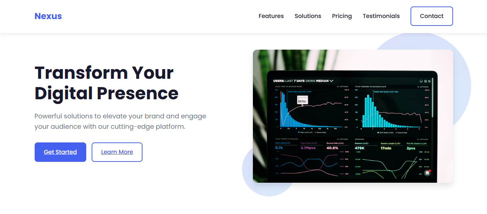

# Modern Responsive Landing Page



A sleek, modern, and fully responsive landing page built with HTML5, CSS3, and JavaScript. Perfect for showcasing products, services, or portfolios.

## Features

- ✅ **Fully Responsive** - Works on all devices
- 🎨 **Modern UI** - Clean design with animations
- ✨ **Interactive Elements** - Tabs, accordions, forms
- 🚀 **Performance Optimized** - Fast loading
- ♿ **Accessible** - WCAG compliant
- 📱 **Mobile-First** Approach

## Technologies Used


## Getting Started

### Prerequisites

- Web browser (Chrome, Firefox, Safari, Edge)
- Code editor (VS Code recommended)

### Installation

1. Clone the repository:
   ```bash
   git clone https://github.com/your-username/modern-landing-page.git
   ```
2. Navigate to project directory:
   ```bash
   cd modern-landing-page
   ```
3. Open `index.html` in your browser

## Project Structure

```
modern-landing-page/
├── index.html          # Main HTML file
├── styles.css          # CSS styles
├── script.js           # JavaScript functionality
├── README.md           # Documentation

```

## Customization

### Change Colors
Edit the CSS variables in `styles.css`:
```css
:root {
    --primary: #4361ee;
    --primary-dark: #3a56d4;
    --secondary: #3f37c9;
    --accent: #4895ef;
    /* ... */
}
```

### Update Content
Modify the HTML in `index.html` to reflect your brand.

### Add Images
Replace placeholder images in `assets/images/`.

## Deployment

### GitHub Pages
1. Go to Repository Settings
2. Select "Pages" in sidebar
3. Choose "main" branch and root folder
4. Your site will be live at:  
   `https://your-username.github.io/modern-landing-page/`

[](https://app.netlify.com/start/deploy?repository=https://github.com/your-username/modern-landing-page)

## Contributing

Contributions are welcome! Follow these steps:

1. Fork the project
2. Create your feature branch (`git checkout -b feature/AmazingFeature`)
3. Commit your changes (`git commit -m 'Add some amazing feature'`)
4. Push to the branch (`git push origin feature/AmazingFeature`)
5. Open a Pull Request

## License

Distributed under the MIT License. See `LICENSE` for more information.

## Contact

Your Name - [@toomeydev](https://x.com/toomeydev) - toomeyastephen@gmil.com

Project Link: [https://github.com/your-username/modern-landing-page](https://github.com/your-username/modern-landing-page)
